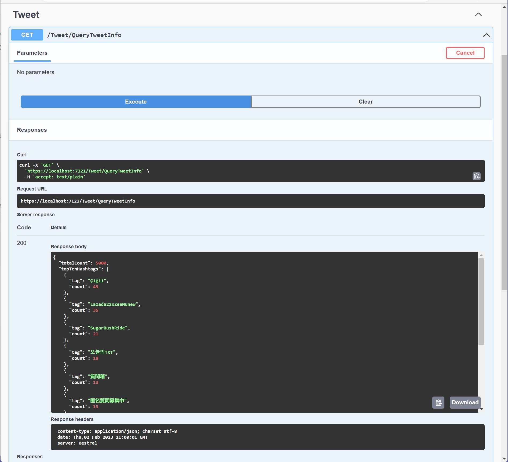
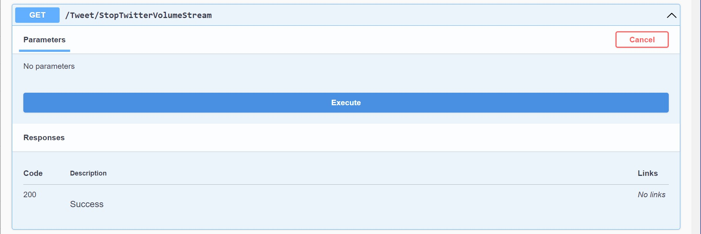
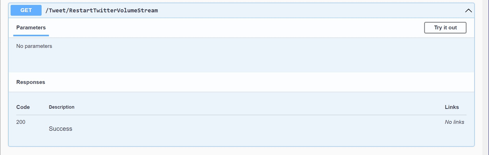

# Code Challenge Project

## Dependencies: 
1. .NET 7
1. VS 2022
1. This application uses the Twitter v2 API. See: https://developer.twitter.com/en/docs/twitter-api/getting-started/about-twitter-api

## Authentication

1. Right click on the CodeChallengeAPI project and select Manage User Secrets
2. In the secrets.json file place the json below. You will need to get the specified values from an application you registered in the Twitter developer portal.
    see: https://developer.twitter.com/
3. You will need to use either the ConsumerKey/ConsumerSecret combination or the BearerToken by itself. There is no need to use both the ConsumerKey/ConsumerSecret 
combination and BearerToken. If a BearerToken is present it will be used.
See: https://developer.twitter.com/en/docs/authentication/oauth-2-0/application-only

```json
{
    "TwitterAuthConfig": {
        "BearerTokenRequestEndpoint": "https://api.twitter.com/oauth2/token",
        "ApplicationName": "YOUR TWITTER APP NAME HERE",
        "ConsumerKey": "YOUR TWITTER APPLICATION CONSUMER KEY HERE",
        "ConsumerSecret": "YOUR TWITTER APPLICATION CONSUMER SECRET HERE",
        "BearerToken": "YOUR TWITTER APPLICATION BEARER TOKEN GOES HERE"
    },
    "TwitterConfig": {
        "VolumeStreamEndpoint": "https://api.twitter.com/2/tweets/sample/stream"
    }
}
```

## Start The Project
1. Make sure the CodeChallengeAPI project is set as the startup project and start the project with or without debugging.
2. A swagger API definition page should appear (https://localhost:7121/swagger/index.html). This will let you demo 3 actions
   - **QueryTweetInfo** - Will return the Total Count of Tweets and the Top 10 requested Hashtags as a json representation.
   

   - **StopTwitterVolumeStream** - This will stop the tweet streaming.
   

   - **RestartTwitterVolumeStream** - This will restart the tweet streaming.
   